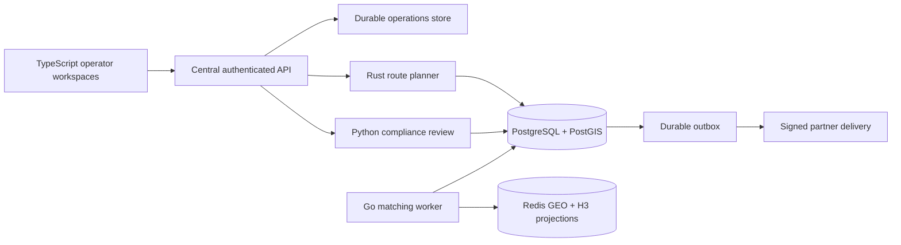
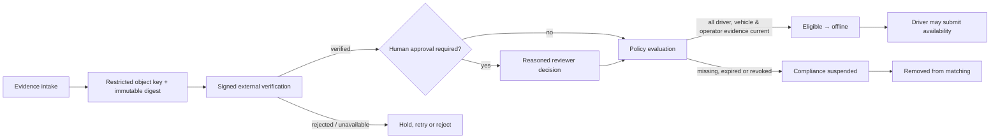

# Clean-Room Logistics Roadmap & Lagos Compliance Architecture

## Slide 1 — Title: From delivery platform to governed mobility operations

**Subtitle:** An independent logistics roadmap and Lagos private-beta compliance architecture

**Key message:** DeliveryPlatform is extending its durable commerce and dispatch foundation into original, multi-tenant logistics and safety-governed mobility capabilities. The work deliberately avoids Fleetbase code, API, schema, visual, and branding compatibility.

**Visual direction:** Full-bleed Lagos mobility corridor visual, dark navy overlay, small label: “Independent implementation · protected private-beta posture.”

**Presenter note:** Position the programme as a clean-room capability build rather than an imitation or migration.

---

## Slide 2 — The operating problem

**Headline:** Delivery operations fail when spatial, workflow, financial, and compliance state diverge.

| Operational failure | Independent platform response |
|---|---|
| Work has ambiguous ownership or stale state | Tenant-scoped work orders, idempotency keys, immutable event history |
| Drivers are chosen on stale location data | Durable versioned presence, Redis GEO/H3 acceleration, PostGIS eligibility checks |
| Route decisions cannot be explained | Persisted plan version, stop legs, algorithm version, and distance snapshot |
| Compliance is a spreadsheet process | Verified evidence, human gates, expiry reconciliation, dispatch eligibility projection |
| Partner events are dropped or replayed | Signed subscriptions, retry queue, delivery attempts, and dead-letter evidence |

**Key message:** The platform separates fast projections from durable business authority.

---

## Slide 3 — Independent clean-room capability roadmap

**Headline:** A staged, original capability set built around open standards and durable service boundaries.

| Workstream | Delivered | Next original increments |
|---|---|---|
| Operations | Service zones, work orders, stops, controlled transitions, tracking, signed event delivery | Workflow designer, exception playbooks, partner console |
| Spatial execution | Redis GEO, H3 cells/rings, PostGIS verification, matching safeguards | Multi-stop optimisation, traffic-aware ETA adapter, capacity constraints |
| Finance | Verified payment state, immutable ledger events, payout holds | Dispute operations, invoice/reconciliation workspace, multi-provider routing |
| Governance | Tenant scope, audit records, policy versions, Kubernetes controls | Retention controls, delegated approval, data-residency configurations |
| Experience | Operator workspaces with live APIs | Driver/rider mobile workflows, map playback, external developer portal |

**Key message:** Parity is assessed by independently specified outcomes, not by copying a competitor’s implementation.

---

## Slide 4 — Architecture principles

**Headline:** Postgres is authoritative; Redis is fast; services are bounded.

**Design rules:** Use PostgreSQL/PostGIS for eligibility, assignments, money, and audit. Use Redis only for bounded candidate acceleration and liveness. Every cross-service action is authenticated, time-bounded, and idempotent.

---

## Slide 5 — H3, Redis GEO, and PostGIS matching path

**Headline:** Fast candidate discovery without trusting cache state.

1. The driver app submits a signed, monotonically versioned location event to the Go service.
2. The worker records the event and H3 cell in PostgreSQL before projecting it to Redis GEO and H3 cell memberships.
3. A trip query expands a bounded H3 ring and reads Redis candidate IDs.
4. The worker validates candidates in PostGIS and PostgreSQL against zone, freshness, safety, and eligibility predicates.
5. Conditional durable reservation and unique assignment guards decide the winning offer.
6. Redis entries are removed promptly after reservation; reconciliation repairs missed projections.

**Validation evidence:** The controlled 10,000 logical-driver simulation accepted 10,000/10,000 versioned location updates and returned 10,000/10,000 spatial candidate queries without observed database deadlocks or rollbacks. This is a controlled local safety test, not a production SLO certificate.

---

## Slide 6 — Rust route planning: explainable, pickup-safe logistics

**Headline:** Route plans are durable operational decisions—not transient map responses.

| Input | Processing | Durable output |
|---|---|---|
| Tenant-owned work order and incomplete stops | Internal authorization; routeability check; pickup-safe deterministic nearest-neighbour heuristic | Route-plan ID, plan version, algorithm version, planning snapshot |
| Coordinates from PostGIS | Geodesic leg distance calculation and stop sequencing | Ordered stop legs, arrival offsets, total distance |
| Concurrent plan request | Unique plan version and conflict retry; supersede only after new plan writes | One current `planned` version per work order |

**Integration evidence:** A real Rust service process against PostgreSQL/PostGIS persisted one three-stop route plan with the pickup first and a 3,592.94 m recorded total distance.

---

## Slide 7 — Lagos onboarding and vehicle verification control flow

**Headline:** Automate evidence handling, require humans for high-impact approvals.

**Key message:** The browser never receives provider credentials or raw identity documents. The platform retains references, digest, reviewer rationale, expiry, policy version, and audit evidence.

---

## Slide 8 — Compliance state and safety separation

**Headline:** Compliance automation cannot override safety or fraud controls.

| State | Owner | Re-activation rule |
|---|---|---|
| `pending_compliance` | Onboarding workflow | All required controls verified |
| `compliance_suspended` | Compliance service | Fresh evidence + required human decision + recalculated eligibility |
| `suspended` | Safety, fraud, or manual control | Only owning safety/fraud authority may restore it |
| `offline` | Driver presence | Driver can choose availability after eligibility is valid |

**Control correction:** A distinct `compliance_suspended` state prevents a compliance refresh from accidentally clearing an unrelated safety or fraud suspension.

**Integration evidence:** The automated workflow verified 11 evidence records, activated eligibility before an expiry event, and then moved the driver to ineligible `compliance_suspended` after expiry reconciliation.

---

## Slide 9 — Private-beta compliance requirements and operating model

**Headline:** Private beta needs evidence, operating authority, and continuous controls—not merely a product feature.

| Control domain | Required launch evidence |
|---|---|
| Lagos operating authority | Current written confirmation of applicable operator approval, reporting, service-zone, and private-beta treatment |
| Driver competence | Identity, current licence, LASDRI applicability confirmation, training, safety checks, and consent records |
| Vehicle condition | Registration, roadworthiness/inspection evidence, vehicle safety checklist, commercial passenger coverage |
| Insurance | Broker/insurer confirmation covering commercial passenger/e-hailing use, claims process, and expiry controls |
| Privacy | DPIA, policy/notice, lawful basis, restricted access, retention, DSR process, and breach playbook |
| Payments | CBN-licensed provider approval for collection and payout model, signed callback verification, reconciliation and dispute procedures |
| Safety operations | 24/7 escalation, incident commander, evidence chain, suspension/reactivation authority, insurer/provider contacts |

**Boundary:** Current requirements, fees, and approvals require written confirmation by the competent authorities, insurer, provider, and qualified advisers before passenger trips.

---

## Slide 10 — Deployment and reliability controls

**Headline:** Every service is packaged with a constrained operational boundary.

- Kubernetes: dedicated no-permission runtime identities, restricted Pod Security Admission, default-deny policy with explicit service paths, External Secrets contracts, HPA/PDB, probes, and topology spread.
- Delivery: CI validates TypeScript, Go race targets, Rust tests, Python compilation, static gates, manifests, security posture, migrations, and real PostgreSQL/PostGIS microservice integration.
- Resilience: HPA/PDB node-failure simulator covered 42 scenarios with zero modeled availability violations; a managed staging-cluster CNI and real disruption test remains mandatory.
- Recovery: logical backup/restore verification and migration rollback rehearsal are in place; encrypted offsite backups, WAL/PITR, retention/immutability, and full production restore drills remain public-launch gates.

---

## Slide 11 — Roadmap, acceptance gates, and decision

**Headline:** Expand only when safety, data, and service reliability are demonstrated in the target environment.

| Horizon | Scope | Exit gate |
|---|---|---|
| Now | Clean-room operations, H3 dispatch foundation, route planning, compliance review | Current cross-language integration passes; policy and authority evidence reviewed |
| Private beta | One city, bounded zones, one vehicle class, card-only payments, named reviewers | Zero expired blocking evidence; safety/tabletop drill; payment/insurance/regulatory written confirmation |
| Controlled expansion | Map/ETA adapters, workflow authoring, disputes, partner APIs, mobile stakeholder apps | Target-cluster CNI, monitoring, identity, backup/PITR, and capacity/load tests pass |
| Public launch | Multi-zone service with on-call and mature financial/compliance operations | Formal go/no-go approval; measured SLOs, recovery objectives, and audited controls met |

**Closing message:** Build independent capability deliberately: operationally explainable, financially reconcilable, safety-governed, and locally compliant.

---

## Slide 12 — References and validated implementation evidence

- Lagos State Drivers’ Institute: certification and recertification information. https://www.new.lasdri.org/
- Lagos State Government: LASDRI CBT recertification notice, 14 August 2024. https://lagosstate.gov.ng/news/License,%20Permits%20&%20Applications/view/6724e4558bec126a8aa4abaf
- National Insurance Commission. https://naicom.gov.ng/
- Nigeria Data Protection Commission, General Application and Implementation Directive. https://ndpc.gov.ng/wp-content/uploads/2025/07/NDP-ACT-GAID-2025-MARCH-20TH.pdf
- Repository evidence: `validation/logistics_microservice_integration_suite_20260903/summary.json`, `validation/cleanroom_logistics_compliance_workflow_implementation_20260903.md`, and `validation/driver_location_h3_load_20260903/summary.md`.

**Footer:** Legal, insurance, regulatory, and provider confirmations must be current and written; this presentation is an implementation and operations plan, not a regulatory approval.
