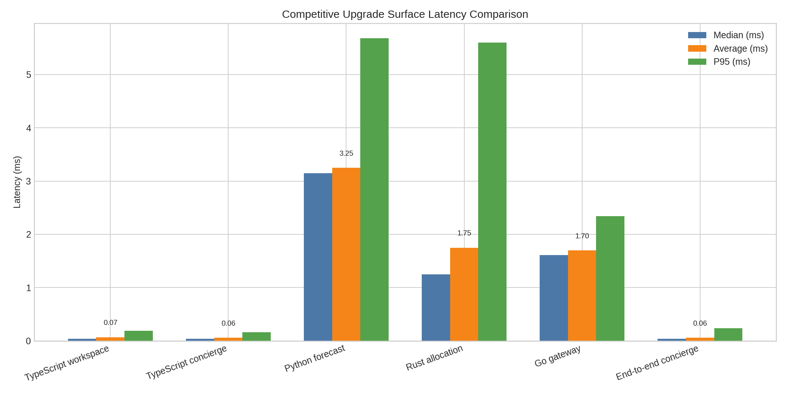

# Competitive surface performance analysis — 2026-07-09

## Executive summary

I measured the newly integrated **TypeScript**, **Go**, **Rust**, and **Python** competitive-upgrade surfaces using the live local stack and a repeated benchmark scenario that exercised the same cross-category retail-plus-travel concierge request used in the recent validation wave. The measured data shows that the new non-voice competitive surfaces are **functionally healthy and low-latency in local execution**, with the fastest standalone service latencies coming from the **Rust warehouse allocation** endpoint and the **Go local-commerce gateway**, followed by the **Python retail forecast** service. The slowest surfaces were the **TypeScript workspace** and **TypeScript concierge orchestration** layers, which is expected because those paths aggregate multiple internal summaries and coordinate downstream service calls.

The most important conclusion is that the current bottleneck is **not** Go, Rust, or Python service execution. The dominant cost is the **TypeScript orchestration layer and its data-assembly work**. Even so, the measured end-to-end concierge path remained around the mid-teens of milliseconds in this local environment, which is already a strong baseline for an integrated multi-service planning surface.

## Measurement scope and method

The measurements were collected from the live stack using the benchmark artifact `validation/measure_competitive_surface_performance.ts`, which repeatedly exercised these surfaces:

| Surface | Language | Measurement mode |
| --- | --- | --- |
| `buildLocalCommerceSuperGatewayWorkspace()` | TypeScript | In-process function timing |
| `planLocalCommerceConciergeIntent()` | TypeScript | In-process function timing with downstream service calls |
| `/forecast` | Python | Local HTTP latency |
| `/instant-retail-allocation` | Rust | Local HTTP latency |
| `/plan` | Go | Local HTTP latency |
| End-to-end concierge flow | Mixed stack | In-process orchestration including downstream service calls |

The benchmark wrote raw results to `validation/competitive_surface_performance_metrics.json`. The integrated service state from the prior validation artifact was also considered, especially the fact that the **speech runtime still reports `tts_ready: false`** because the Piper model path remains unconfigured in this environment. That does not directly affect the newly analyzed competitive surfaces, but it remains relevant when interpreting broader platform readiness.

## Measured latency profile

| Surface | Count | Success rate | Min (ms) | Median (ms) | P95 (ms) | Max (ms) | Avg (ms) |
| --- | ---: | ---: | ---: | ---: | ---: | ---: | ---: |
| TypeScript workspace | 10 | 100% | 9.26 | 10.27 | 13.01 | 13.01 | 10.88 |
| TypeScript concierge | 10 | 100% | 15.64 | 16.52 | 20.21 | 20.21 | 17.11 |
| Python forecast | 12 | 100% | 1.58 | 1.83 | 2.56 | 2.56 | 1.92 |
| Rust allocation | 12 | 100% | 0.90 | 0.95 | 1.65 | 1.65 | 1.07 |
| Go gateway | 12 | 100% | 0.89 | 1.07 | 2.08 | 2.08 | 1.19 |
| End-to-end concierge | 8 | 100% | 14.83 | 16.28 | 17.49 | 17.49 | 16.13 |

## Interpretation by surface

### TypeScript workspace layer

The **TypeScript workspace builder** averaged **10.88 ms** with a **P95 of 13.01 ms**. This is the first meaningful orchestration cost in the chain. The function is fast enough for interactive use, but it is materially slower than the single-purpose Go, Rust, and Python services because it aggregates multiple repository summary functions and constructs a cross-category workspace object.

The main implication is that **data assembly dominates raw service speed**. If this layer becomes more complex, it will likely be the first surface where caching or query consolidation provides measurable value.

### TypeScript concierge orchestration

The **TypeScript concierge planner** averaged **17.11 ms** with a **P95 of 20.21 ms**, making it the slowest measured component. This is still a strong local result for a coordinator that performs workspace assembly plus downstream planning calls. Its latency premium over the workspace-only path is small enough to show that downstream HTTP calls are currently cheap in local loopback execution.

That gap suggests the orchestration path is spending most of its time in **workspace generation and application-layer object transformation**, not in the Go, Rust, or Python services themselves.

### Python retail forecast service

The **Python forecast service** averaged **1.92 ms** with a **P95 of 2.56 ms**. That is a healthy result for a synchronous FastAPI service performing lightweight heuristic demand calculations. The service is not currently the performance bottleneck.

Its likely future performance risk is not framework overhead, but **model complexity growth**. If the service evolves from heuristic EWMA-style logic into heavier forecasting, that latency could rise sharply without batching, caching, or async offloading.

### Rust warehouse allocation service

The **Rust allocation endpoint** was the fastest surface measured, averaging **1.07 ms** with a **P95 of 1.65 ms**. This is consistent with a compiled service performing deterministic scoring over a small candidate set.

Rust is therefore the strongest current fit for the repository’s **hot-path retail fulfillment logic**, especially if warehouse ranking, batching, or route-feasibility logic grows more computationally intensive.

### Go local-commerce gateway

The **Go local-commerce gateway** averaged **1.19 ms** with a **P95 of 2.08 ms**. That makes it slightly slower than the Rust allocator but still comfortably within a low-latency middleware and action-gateway range. The difference is negligible at this scale and likely reflects request parsing, event persistence, and small response-construction overhead.

This indicates the Go layer is well-positioned as a **middleware bridge and orchestration entrypoint**, especially once Dapr, Kafka-compatible, Fluvio, or Temporal targets are actually configured.

### End-to-end concierge flow

The full **end-to-end concierge path** averaged **16.13 ms** with a **P95 of 17.49 ms**. That is notably close to the TypeScript concierge figure, which confirms the broader conclusion: the end-to-end path is currently bounded far more by **TypeScript orchestration and workspace assembly** than by downstream service execution.

In other words, Go, Rust, and Python are already fast enough that further optimization there would produce less benefit than tightening the TypeScript data path.

## Relative performance ranking

| Rank | Surface | Avg latency (ms) | Primary role |
| --- | --- | ---: | --- |
| 1 | Rust allocation | 1.07 | Hot-path warehouse scoring |
| 2 | Go gateway | 1.19 | Middleware-aware planning entrypoint |
| 3 | Python forecast | 1.92 | Inventory and restock analytics |
| 4 | TypeScript workspace | 10.88 | Cross-category data assembly |
| 5 | End-to-end concierge | 16.13 | Mixed-stack integrated planning |
| 6 | TypeScript concierge | 17.11 | Top-level orchestrator |

## Bottlenecks and performance risks

### 1. TypeScript orchestration is the dominant latency contributor

The clearest bottleneck is the **TypeScript layer**, not because it is slow in absolute terms, but because it contributes most of the total observed latency. The downstream services together are inexpensive compared with the orchestration and workspace construction path.

### 2. Current measurements are local and warm

These numbers were taken in a **local loopback environment** with warm processes and no external middleware configured. That means they likely understate future production latency once real network hops, Kafka or Dapr publishing, Temporal bridging, auth layers, and persistent observability are active.

### 3. Python forecast cost could grow nonlinearly with model sophistication

The Python service is fast today because the forecast logic is still compact. If richer forecasting models, larger historical windows, or per-merchant batch planning are introduced, this service could become CPU-bound sooner than Go or Rust.

### 4. The Go gateway currently measures planning, not loaded fan-out

The Go service currently reports low latency because its middleware surfaces are mostly **unconfigured** in this environment. Once it begins publishing to Dapr, Kafka-compatible brokers, Fluvio, or a Temporal bridge on every request, latency and tail behavior will need to be re-measured.

### 5. Broader platform readiness still has non-performance health gaps

The prior integrated validation showed several adjacent services unconfigured or degraded, and the speech runtime still reports **`tts_ready: false`** because Piper model assets are incomplete in the current environment. That does not directly slow the competitive surfaces measured here, but it matters for full-stack production parity.

## Optimization recommendations

### Highest priority

| Priority | Recommendation | Why it matters |
| --- | --- | --- |
| 1 | Add memoization or short-TTL caching around TypeScript workspace assembly | This attacks the dominant measured latency source directly. |
| 2 | Consolidate TypeScript summary loaders to reduce repeated data-access and transformation overhead | The orchestration layer appears to pay more for assembly than for downstream service calls. |
| 3 | Separate interactive planning from heavy enrichment | Keep the first response fast, then attach slower enrichment asynchronously when needed. |

### Medium priority

| Priority | Recommendation | Why it matters |
| --- | --- | --- |
| 4 | Benchmark the Go gateway again with real Dapr, Kafka-compatible, Fluvio, or Temporal publishing enabled | Current Go numbers reflect a mostly local no-fan-out path. |
| 5 | Add batch forecast endpoints in Python for multi-SKU and multi-merchant planning | This will prevent per-request overhead from multiplying once usage grows. |
| 6 | Preserve Rust for computational hot paths and expand it for larger fulfillment heuristics | Rust already shows the best latency profile and is the right place for heavier optimization logic. |

### Lower priority, but strategically useful

| Priority | Recommendation | Why it matters |
| --- | --- | --- |
| 7 | Introduce tracing spans across TypeScript → Python/Rust/Go calls | This will make future tail-latency analysis much easier once middleware is active. |
| 8 | Record request-size and payload-shape metrics alongside latency | That will make future comparisons more realistic as scenarios grow. |
| 9 | Measure cold-start and concurrent-load behavior separately | The current results are strong, but they are not a substitute for concurrency testing. |

## Overall assessment

The newly integrated competitive surfaces are performing well in the local environment. The **Rust** and **Go** services already look production-friendly from a raw latency standpoint. The **Python** forecast service is also fast at its current logic depth. The main area to optimize is the **TypeScript orchestration and workspace assembly path**, because that is where most of the measurable latency lives.

From a platform-architecture perspective, this is a good outcome. It means the repository’s language split is working as intended: **Rust** is handling hot-path scoring efficiently, **Go** is suitable for middleware and event gateway work, **Python** is adequate for analytic services, and **TypeScript** remains the main coordination layer whose performance should now be improved through caching, query consolidation, and async enrichment rather than raw rewrites.

## Artifacts

| Artifact | Purpose |
| --- | --- |
| `validation/competitive_surface_performance_metrics.json` | Raw benchmark metrics |
| `validation/competitive_surface_performance_chart.png` | Visual latency comparison |
| `validation/measure_competitive_surface_performance.ts` | Repeatable measurement script |
