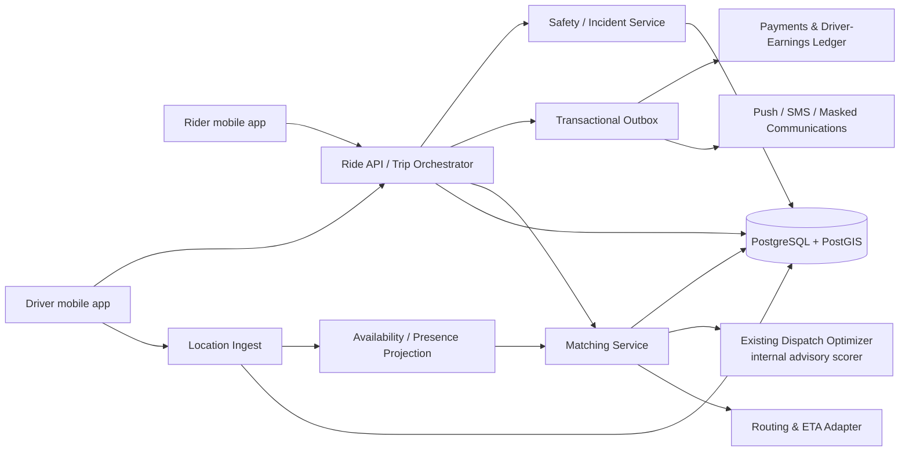
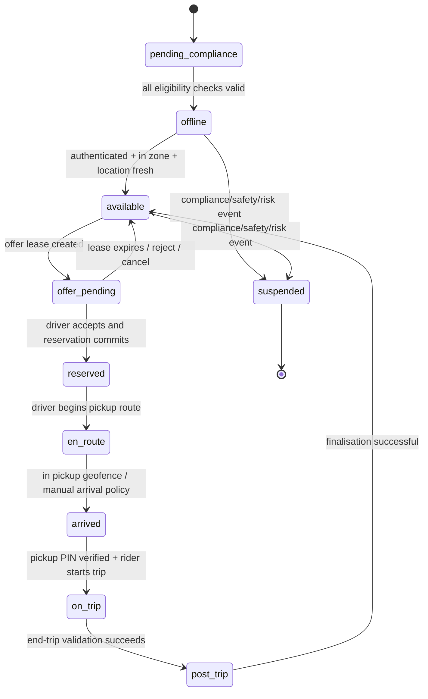

# Real-Time Passenger–Driver Matching and Nigeria Private-Beta Specification

**Candidate city:** Lagos, Nigeria.  
**Operating scope:** A single-city, invitation-only passenger ride-hailing beta with one vehicle class, one compact service zone, card-based payments via a licensed provider, no cash, no pooling, no airport/venue exceptions, and staffed operating/safety coverage.  
**Design principle:** PostgreSQL with PostGIS is the authoritative transactional and geospatial system of record. A presence cache may accelerate searches, but it must never become the source of truth for eligibility, trips, money, or compliance.

> **Legal and insurance notice:** I’m an AI, not a lawyer—this is a working technical and regulatory analysis, not formal legal advice. Nigerian transportation, insurance, employment, privacy, tax, payments, and consumer-protection obligations are jurisdiction- and fact-specific. Nigerian counsel, a Lagos transportation adviser, a licensed insurance broker, and the relevant regulators must validate the launch requirements in writing before any passenger trip is offered.

## 1. Executive design decision

The current DeliveryPlatform dispatch optimizer is useful as an advisory ranking component, but it is not a passenger ride-matching engine. Its existing candidate loader chooses from a small generic online-driver set and uses heuristic location strings and fixed distance estimates. Passenger transport instead requires a durable trip state machine, real latitude/longitude location, geospatial indexes, driver compliance eligibility, atomic reservation, accepted-offer leases, fare auditability, and a safety/incident boundary.

The recommended architecture has one authoritative **Ride Orchestrator** and one **Matching Service**. The orchestrator owns trip and driver-reservation transitions; the matching service reads a current availability projection, produces ranked candidate offers, and records its inputs and decision version. The existing Rust dispatch optimizer should become an internal scoring module behind the matching service. It must never independently assign a driver, mutate a trip, capture money, or override compliance/safety exclusions.

## 2. Scope, non-goals, and design targets

| Area | Private-beta requirement | Explicit beta exclusion |
|---|---|---|
| Geography | Named Lagos service-zone polygons and hard geofences. | Out-of-zone matching, cross-city trips, or airport/venue rules unless explicitly approved. |
| Trip type | Point-to-point passenger ride with one rider group and one vehicle class. | Pooling, shared rides, multi-stop, scheduled/reserved rides, cash, minors-only service, and premium categories. |
| Driver assignment | One active passenger assignment per driver; durable offer and reservation lease. | “Best-effort” broadcast that permits multiple clients to claim the same driver. |
| Location | Authenticated, timestamped driver location, quality/provenance flags, and bounded retention. | Trusting client-side status or raw coordinates without validation. |
| Pricing | Versioned quote and fare rules; charge only through a licensed provider. | Unbounded opaque surge logic, stored value, or unlicensed payment/wallet operation. |
| Safety | Pickup verification, trip sharing, emergency case creation, restricted safety data access, staffed escalation. | Fully automated safety disposition or unstaffed live passenger operations. |

The following are **engineering targets**, not guaranteed service levels. For a compact beta zone, use a p95 location-ingest acknowledgement target of 250 ms, p95 candidate-query target of 300 ms, p95 reservation-commit target of 500 ms, and no more than a single active passenger assignment per driver. Set final targets using Lagos field telemetry, map-provider performance, mobile network behavior, and safety/operator requirements.

## 3. Logical service architecture



The mobile applications issue authenticated calls only to the Ride API and Location Ingest boundary. Neither app writes driver availability, assignment, trip completion, fare, or safety outcomes directly to a database. The Ride API performs policy and compliance checks, calls the matching engine, makes state changes in a PostgreSQL transaction, and emits side effects through a transactional outbox.

### Component boundaries

| Component | Owns | May read | Must not do |
|---|---|---|---|
| Ride API / Trip Orchestrator | `ride_trip` lifecycle, quote acceptance, cancellation, reservation commit, payment intent, rider-facing projection. | Driver eligibility projection, match decision, routing result. | Score candidates or allow a mobile client to force a state transition. |
| Location Ingest | Driver-device authentication, coordinate validation, location samples, current-presence update. | Driver/device registration, service zones. | Start/end a trip or change financial state. |
| Matching Service | Candidate query, eligibility filtering, ETA estimation, deterministic scoring, offer wave, match-decision audit. | Current presence, driver compliance projection, trip request. | Own final assignment; final commit belongs to the orchestrator. |
| Dispatch Optimizer | Advisory feature-vector scoring and supply balancing. | Sanitized candidate and trip feature set. | Access passenger PII, payments, raw safety evidence, or database mutation. |
| Fare/Metering Service | Immutable quote, fare-rule version, ride distance/time evidence, final fare calculation. | Completed trip samples and approved fees. | Edit a historical quote/fare without compensating adjustment event. |
| Safety/Incident Service | SOS, safety case, incident timeline, restricted evidence, legal hold, emergency escalation. | Minimum trip/rider/driver context. | Expose a case through ordinary support or dispatch roles. |

## 4. Authoritative state machines

### Driver availability and assignment state



`pending_compliance`, `suspended`, `offline`, `available`, `offer_pending`, `reserved`, `en_route`, `arrived`, `on_trip`, and `post_trip` are server-owned states. The driver app requests a transition; it does not assert it. `available` requires a current location, valid service-zone membership, valid driver/vehicle insurance and documents, no active trip, no suspension, and an accepted device/session.

### Passenger trip state

| State | Entry condition | Legal next states | Server-side invariant |
|---|---|---|---|
| `quote_created` | Valid rider, pickup/destination in allowed zone, active fare version. | `requested`, `expired`, `cancelled`. | Quote has expiry, fare-rule version, routing inputs, and disclosure text version. |
| `requested` | Rider accepts unexpired quote and payment pre-authorisation/policy check passes. | `matching`, `cancelled`, `payment_failed`. | Idempotency key unique per rider action. |
| `matching` | Orchestrator creates match attempt. | `driver_offered`, `cancelled`, `unfulfilled`. | One open match attempt per live trip. |
| `driver_offered` | Candidate offer wave recorded. | `driver_reserved`, `matching`, `cancelled`, `unfulfilled`. | Offer lease has expiry; a driver cannot receive conflicting active passenger offers. |
| `driver_reserved` | Driver acceptance and atomic reserve succeed. | `driver_en_route`, `cancelled`, `matching`. | Unique active assignment for both driver and trip. |
| `driver_en_route` | Driver confirms movement toward pickup. | `driver_arrived`, `cancelled`, `matching`. | Pickup ETA and location telemetry are tracked. |
| `driver_arrived` | Geofence/manual arrival policy satisfied. | `pickup_verified`, `cancelled`, `matching`. | Pickup evidence is retained. |
| `pickup_verified` | Rider PIN or approved equivalent succeeds. | `in_progress`, `cancelled_before_start`. | No passenger trip starts without server confirmation. |
| `in_progress` | Start-trip guard succeeds. | `completed_pending_payment`, `safety_paused`. | Metering samples and route-quality signals are written. |
| `completed_pending_payment` | End-trip guard succeeds. | `completed`, `payment_review`, `safety_paused`. | Final fare calculation is immutable and versioned. |
| `completed` | Payment/ledger policy completes or approved post-paid path applies. | `disputed`, `refunded`. | Receipt, driver earning, and ledger records reconcile. |

No transition deletes prior state. A `trip_event` record is appended in the same transaction as the materialized `ride_trip` update.

## 5. PostgreSQL and PostGIS data model

### 5.1 Core extensions and identifiers

Use PostgreSQL UUID primary keys for externally visible ride entities, `timestamptz` in UTC, and `numeric(14,2)` for Naira amounts. Enable `postgis`, `pgcrypto`, and `citext`. Keep user account identifiers in the existing identity domain; the mobility schema references those UUIDs rather than duplicating credentials.

```sql
CREATE EXTENSION IF NOT EXISTS postgis;
CREATE EXTENSION IF NOT EXISTS pgcrypto;
CREATE EXTENSION IF NOT EXISTS citext;

CREATE TYPE ride_trip_status AS ENUM (
  'quote_created', 'requested', 'matching', 'driver_offered',
  'driver_reserved', 'driver_en_route', 'driver_arrived',
  'pickup_verified', 'in_progress', 'completed_pending_payment',
  'completed', 'cancelled', 'unfulfilled', 'payment_failed',
  'payment_review', 'safety_paused', 'disputed', 'refunded'
);

CREATE TYPE driver_presence_status AS ENUM (
  'pending_compliance', 'offline', 'available', 'offer_pending',
  'reserved', 'en_route', 'arrived', 'on_trip', 'post_trip', 'suspended'
);
```

### 5.2 Service zones and fare zones

```sql
CREATE TABLE mobility_service_zone (
  id uuid PRIMARY KEY DEFAULT gen_random_uuid(),
  city_code text NOT NULL CHECK (city_code = 'LAG'),
  slug citext NOT NULL UNIQUE,
  display_name text NOT NULL,
  boundary geometry(MultiPolygon, 4326) NOT NULL,
  active boolean NOT NULL DEFAULT false,
  dispatch_enabled boolean NOT NULL DEFAULT false,
  effective_from timestamptz NOT NULL,
  effective_to timestamptz,
  policy_version text NOT NULL,
  created_at timestamptz NOT NULL DEFAULT now(),
  CHECK (ST_IsValid(boundary))
);
CREATE INDEX mobility_service_zone_boundary_gix
  ON mobility_service_zone USING gist (boundary);
```

A ride must record the zone and `policy_version` applied when it was quoted. Zone changes never rewrite existing ride records. This makes a dispute, safety case, or regulator report reproducible.

### 5.3 Driver, vehicle, and compliance eligibility

```sql
CREATE TABLE mobility_driver_profile (
  driver_id uuid PRIMARY KEY REFERENCES users(id),
  legal_name text NOT NULL,
  display_name text NOT NULL,
  rider_visible_rating numeric(3,2),
  account_status text NOT NULL CHECK (account_status IN ('pending','active','suspended','deactivated')),
  safety_status text NOT NULL CHECK (safety_status IN ('clear','review','hold','blocked')),
  created_at timestamptz NOT NULL DEFAULT now(),
  updated_at timestamptz NOT NULL DEFAULT now()
);

CREATE TABLE mobility_vehicle (
  id uuid PRIMARY KEY DEFAULT gen_random_uuid(),
  driver_id uuid NOT NULL REFERENCES mobility_driver_profile(driver_id),
  registration_number citext NOT NULL,
  make text NOT NULL,
  model text NOT NULL,
  year integer NOT NULL CHECK (year BETWEEN 1990 AND 2100),
  colour text NOT NULL,
  passenger_capacity smallint NOT NULL CHECK (passenger_capacity BETWEEN 1 AND 8),
  vehicle_class text NOT NULL,
  active boolean NOT NULL DEFAULT false,
  UNIQUE (registration_number)
);

CREATE TABLE mobility_compliance_evidence (
  id uuid PRIMARY KEY DEFAULT gen_random_uuid(),
  subject_kind text NOT NULL CHECK (subject_kind IN ('driver','vehicle','operator')),
  subject_id uuid NOT NULL,
  evidence_type text NOT NULL CHECK (evidence_type IN (
    'national_driver_license','lasdri_certificate','driver_badge','identity_check',
    'background_screening','vehicle_registration','roadworthiness','vehicle_inspection',
    'commercial_motor_insurance','passenger_cover','operator_permit','training'
  )),
  verifier text NOT NULL,
  external_reference text,
  document_object_key text,
  issued_at timestamptz,
  expires_at timestamptz,
  status text NOT NULL CHECK (status IN ('pending','verified','expired','rejected','revoked')),
  verified_by uuid,
  verified_at timestamptz,
  reason_code text,
  immutable_digest bytea NOT NULL,
  created_at timestamptz NOT NULL DEFAULT now()
);
CREATE INDEX mobility_compliance_subject_active_idx
  ON mobility_compliance_evidence (subject_kind, subject_id, evidence_type, expires_at)
  WHERE status = 'verified';
```

Do not store scanned licences, insurance cards, selfies, or other sensitive source documents in ordinary relational fields. Store encrypted documents in restricted object storage; preserve only an object reference, integrity digest, verifier, dates, status, and audit metadata in PostgreSQL.

Create a materialized, queryable **eligibility projection** refreshed transactionally after evidence review or expiry. Matching queries read that projection rather than recomputing document logic for every candidate.

```sql
CREATE TABLE mobility_driver_eligibility (
  driver_id uuid PRIMARY KEY REFERENCES mobility_driver_profile(driver_id),
  eligible boolean NOT NULL,
  vehicle_id uuid REFERENCES mobility_vehicle(id),
  eligible_until timestamptz,
  exclusion_code text,
  version bigint NOT NULL DEFAULT 1,
  updated_at timestamptz NOT NULL DEFAULT now()
);
CREATE INDEX mobility_driver_eligibility_ready_idx
  ON mobility_driver_eligibility (driver_id, eligible_until)
  WHERE eligible = true;
```

### 5.4 Location samples and hot presence projection

The system requires both append-only audit samples and a one-row current-state projection.

```sql
CREATE TABLE mobility_driver_location_sample (
  id bigint GENERATED ALWAYS AS IDENTITY PRIMARY KEY,
  driver_id uuid NOT NULL REFERENCES mobility_driver_profile(driver_id),
  recorded_at timestamptz NOT NULL,
  received_at timestamptz NOT NULL DEFAULT now(),
  point geography(Point, 4326) NOT NULL,
  accuracy_m real,
  bearing_deg real,
  speed_mps real,
  altitude_m real,
  source text NOT NULL CHECK (source IN ('foreground_gps','background_gps','manual','reconciled')),
  device_session_id uuid NOT NULL,
  sequence_no bigint NOT NULL,
  integrity_score smallint NOT NULL CHECK (integrity_score BETWEEN 0 AND 100),
  quality_flags jsonb NOT NULL DEFAULT '[]'::jsonb,
  UNIQUE (driver_id, device_session_id, sequence_no)
) PARTITION BY RANGE (received_at);
CREATE INDEX mobility_driver_location_sample_point_gix
  ON mobility_driver_location_sample USING gist (point);
CREATE INDEX mobility_driver_location_sample_driver_time_idx
  ON mobility_driver_location_sample (driver_id, received_at DESC);

CREATE TABLE mobility_driver_presence (
  driver_id uuid PRIMARY KEY REFERENCES mobility_driver_profile(driver_id),
  status driver_presence_status NOT NULL,
  zone_id uuid REFERENCES mobility_service_zone(id),
  last_point geography(Point, 4326),
  last_location_at timestamptz,
  accuracy_m real,
  integrity_score smallint NOT NULL DEFAULT 0,
  active_trip_id uuid,
  active_offer_id uuid,
  offer_expires_at timestamptz,
  reservation_expires_at timestamptz,
  version bigint NOT NULL DEFAULT 1,
  updated_at timestamptz NOT NULL DEFAULT now(),
  CHECK ((status = 'available') = (active_trip_id IS NULL))
);
CREATE INDEX mobility_driver_presence_geo_available_gix
  ON mobility_driver_presence USING gist (last_point)
  WHERE status = 'available' AND last_location_at > now() - interval '90 seconds';
CREATE INDEX mobility_driver_presence_zone_available_idx
  ON mobility_driver_presence (zone_id, updated_at DESC)
  WHERE status = 'available';
```

The partial index should use a stored, queryable freshness field or candidate query parameter rather than an immutable index predicate involving `now()` if the production PostgreSQL version/planner prohibits it. A practical implementation stores `location_fresh_until` during ingest and indexes `WHERE status='available' AND location_fresh_until > CURRENT_TIMESTAMP` through the query plan, or uses zone/H3 partitions plus a GiST index. Validate final index syntax against the target PostgreSQL version.

### 5.5 Trips, match attempts, offers, and reservation guard

```sql
CREATE TABLE mobility_ride_trip (
  id uuid PRIMARY KEY DEFAULT gen_random_uuid(),
  rider_id uuid NOT NULL REFERENCES users(id),
  status ride_trip_status NOT NULL,
  zone_id uuid NOT NULL REFERENCES mobility_service_zone(id),
  pickup geography(Point, 4326) NOT NULL,
  destination geography(Point, 4326) NOT NULL,
  pickup_address text NOT NULL,
  destination_address text NOT NULL,
  quoted_route_m integer NOT NULL CHECK (quoted_route_m >= 0),
  quoted_duration_s integer NOT NULL CHECK (quoted_duration_s >= 0),
  fare_quote_id uuid NOT NULL,
  assigned_driver_id uuid REFERENCES mobility_driver_profile(driver_id),
  assigned_vehicle_id uuid REFERENCES mobility_vehicle(id),
  current_match_attempt_id uuid,
  requested_at timestamptz,
  started_at timestamptz,
  completed_at timestamptz,
  cancellation_actor text,
  cancellation_code text,
  state_version bigint NOT NULL DEFAULT 1,
  created_at timestamptz NOT NULL DEFAULT now(),
  updated_at timestamptz NOT NULL DEFAULT now()
);
CREATE INDEX mobility_ride_trip_rider_recent_idx ON mobility_ride_trip (rider_id, created_at DESC);
CREATE INDEX mobility_ride_trip_driver_active_idx
  ON mobility_ride_trip (assigned_driver_id, updated_at DESC)
  WHERE status IN ('driver_reserved','driver_en_route','driver_arrived','pickup_verified','in_progress','completed_pending_payment');

CREATE TABLE mobility_match_attempt (
  id uuid PRIMARY KEY DEFAULT gen_random_uuid(),
  trip_id uuid NOT NULL UNIQUE REFERENCES mobility_ride_trip(id),
  algorithm_version text NOT NULL,
  request_snapshot jsonb NOT NULL,
  candidate_count integer NOT NULL,
  wave_no smallint NOT NULL DEFAULT 1,
  status text NOT NULL CHECK (status IN ('open','offering','reserved','exhausted','cancelled','expired')),
  created_at timestamptz NOT NULL DEFAULT now(),
  closed_at timestamptz
);

CREATE TABLE mobility_driver_offer (
  id uuid PRIMARY KEY DEFAULT gen_random_uuid(),
  match_attempt_id uuid NOT NULL REFERENCES mobility_match_attempt(id),
  trip_id uuid NOT NULL REFERENCES mobility_ride_trip(id),
  driver_id uuid NOT NULL REFERENCES mobility_driver_profile(driver_id),
  rank smallint NOT NULL,
  score numeric(12,6) NOT NULL,
  score_explanation jsonb NOT NULL,
  offered_at timestamptz NOT NULL DEFAULT now(),
  expires_at timestamptz NOT NULL,
  response text NOT NULL DEFAULT 'pending' CHECK (response IN ('pending','accepted','declined','expired','cancelled')),
  responded_at timestamptz,
  UNIQUE (match_attempt_id, driver_id)
);
CREATE UNIQUE INDEX mobility_driver_offer_one_pending_idx
  ON mobility_driver_offer (driver_id)
  WHERE response = 'pending';

CREATE TABLE mobility_driver_assignment_guard (
  driver_id uuid PRIMARY KEY REFERENCES mobility_driver_profile(driver_id),
  trip_id uuid NOT NULL REFERENCES mobility_ride_trip(id),
  assignment_state text NOT NULL CHECK (assignment_state IN ('reserved','en_route','arrived','on_trip')),
  lease_expires_at timestamptz,
  created_at timestamptz NOT NULL DEFAULT now(),
  updated_at timestamptz NOT NULL DEFAULT now()
);
```

`mobility_driver_assignment_guard` is the decisive constraint that prevents a driver receiving two passenger trips. The orchestrator inserts it in the same transaction as `ride_trip.assigned_driver_id`, `driver_presence.status='reserved'`, offer acceptance, and `trip_event`. A conflicting insert fails at the database, not merely in application memory.

### 5.6 Fare, event, safety, and outbox records

```sql
CREATE TABLE mobility_fare_quote (
  id uuid PRIMARY KEY DEFAULT gen_random_uuid(),
  rider_id uuid NOT NULL REFERENCES users(id),
  zone_id uuid NOT NULL REFERENCES mobility_service_zone(id),
  fare_rule_version text NOT NULL,
  currency char(3) NOT NULL DEFAULT 'NGN',
  base_amount numeric(14,2) NOT NULL,
  distance_amount numeric(14,2) NOT NULL,
  time_amount numeric(14,2) NOT NULL,
  demand_adjustment_amount numeric(14,2) NOT NULL,
  taxes_and_fees_amount numeric(14,2) NOT NULL,
  total_amount numeric(14,2) NOT NULL,
  rationale jsonb NOT NULL,
  expires_at timestamptz NOT NULL,
  created_at timestamptz NOT NULL DEFAULT now()
);

CREATE TABLE mobility_trip_event (
  id uuid PRIMARY KEY DEFAULT gen_random_uuid(),
  trip_id uuid NOT NULL REFERENCES mobility_ride_trip(id),
  sequence_no integer NOT NULL,
  event_type text NOT NULL,
  actor_kind text NOT NULL CHECK (actor_kind IN ('rider','driver','system','operator','provider')),
  actor_id uuid,
  occurred_at timestamptz NOT NULL DEFAULT now(),
  correlation_id uuid NOT NULL,
  idempotency_key text,
  payload jsonb NOT NULL,
  previous_state ride_trip_status,
  next_state ride_trip_status,
  UNIQUE (trip_id, sequence_no),
  UNIQUE (trip_id, idempotency_key)
);

CREATE TABLE mobility_outbox_event (
  id uuid PRIMARY KEY DEFAULT gen_random_uuid(),
  aggregate_type text NOT NULL,
  aggregate_id uuid NOT NULL,
  event_type text NOT NULL,
  payload jsonb NOT NULL,
  created_at timestamptz NOT NULL DEFAULT now(),
  published_at timestamptz,
  attempts integer NOT NULL DEFAULT 0
);
CREATE INDEX mobility_outbox_unpublished_idx ON mobility_outbox_event (created_at) WHERE published_at IS NULL;
```

Safety event detail belongs in a separately encrypted schema/store, linked to the trip only by a case reference and a minimal severity/status projection. Use a distinct service account, separate encryption keys, and case-specific RBAC.

## 6. Geospatial matching algorithm

### 6.1 Location ingestion acceptance rules

The driver client submits a signed location envelope containing driver/device session, monotonic sequence number, observed time, latitude, longitude, horizontal accuracy, bearing, speed, app state, and optional integrity-attestation result. The server rejects coordinates outside the service-zone envelope, coordinates with invalid ranges, stale/replayed sequence numbers, timestamps beyond a configured skew, and low-integrity samples according to the safety policy.

The server writes an append-only sample and updates `mobility_driver_presence` only when the new sample is newer and more credible than the stored one. Each update increments `version`. The client receives a small acknowledgement containing effective status, freshness deadline, and any remediation required; it does not receive its ranking, fraud score, or sensitive eligibility reason.

### 6.2 Candidate selection

Candidate selection has four gates, in the following order:

1. **Trip feasibility:** pickup and destination are in active policy/dispatch zones; route and pickup are permitted; rider payment/risk state is acceptable.
2. **Driver eligibility:** active profile, verified driver/vehicle evidence, unexpired required documents, valid insurance/vehicle class, safety status clear, no active assignment, current authenticated session.
3. **Location eligibility:** `available` status, fresh location, acceptable accuracy/integrity, inside allowed zone, pickup distance within current search radius.
4. **Operational policy:** driver/rider block lists, maximum consecutive duty/shift rule, accessibility/vehicle requirements, surge/cap policy, fairness/anti-starvation policy, and market controls.

The first candidate search uses PostGIS `ST_DWithin` against a bounded radius. The radius then expands in controlled waves, e.g., 1.5 km → 3 km → 5 km, subject to zone policy. Candidate count is capped. Route ETA comes from a routing provider for a shortlist, not every driver in the entire zone.

```sql
WITH candidate AS (
  SELECT p.driver_id, p.last_point, p.accuracy_m, p.integrity_score,
         ST_Distance(p.last_point, $1::geography) AS straight_line_m
  FROM mobility_driver_presence p
  JOIN mobility_driver_eligibility e ON e.driver_id = p.driver_id
  WHERE p.status = 'available'
    AND e.eligible = true
    AND p.last_location_at >= $2
    AND p.integrity_score >= $3
    AND ST_DWithin(p.last_point, $1::geography, $4)
  ORDER BY p.last_point <-> $1::geography
  LIMIT $5
)
SELECT * FROM candidate;
```

The exact KNN expression and operator class must be benchmarked on the target PostgreSQL/PostGIS version. Add an H3 or equivalent discrete-cell key to `mobility_driver_presence` only if observed load makes the GiST approach insufficient; it is an optimization, not a replacement for precise PostGIS validation.

### 6.3 Ranking and decision audit

For shortlisted drivers, calculate a normalized, versioned score. A beta-safe initial model should be intentionally explainable:

```text
score =
  0.45 * pickup_eta_score
+ 0.15 * location_confidence_score
+ 0.10 * driver_reliability_score
+ 0.10 * idle_time_fairness_score
+ 0.10 * acceptance_likelihood_score
+ 0.10 * zone_balance_score
- safety_or_compliance_exclusion
- active_offer_or_assignment_exclusion
- policy_penalty
```

Do not use protected attributes or opaque personal inferences. Every score response stores algorithm version, feature values/bands, excluded candidates by reason code, routing provider version, and candidate order. The system needs this audit to investigate unfairness, availability, safety, and fare/assignment complaints.

### 6.4 Offer waves and atomic reservation

The matching engine returns a ranked list but does not create a trip assignment. The orchestrator creates one or a limited policy-approved batch of offers, each with a short expiry. On acceptance, it executes an atomic reservation transaction:

```sql
BEGIN;

-- Locks current presence and confirms no stale/competing state.
SELECT version, status
FROM mobility_driver_presence
WHERE driver_id = $driver_id
FOR UPDATE;

-- Requires the specific, unexpired pending offer and open trip.
UPDATE mobility_driver_offer
SET response = 'accepted', responded_at = now()
WHERE id = $offer_id
  AND driver_id = $driver_id
  AND response = 'pending'
  AND expires_at > now()
RETURNING trip_id;

INSERT INTO mobility_driver_assignment_guard (driver_id, trip_id, assignment_state, lease_expires_at)
VALUES ($driver_id, $trip_id, 'reserved', now() + interval '2 minutes');

UPDATE mobility_driver_presence
SET status = 'reserved', active_trip_id = $trip_id,
    active_offer_id = NULL, reservation_expires_at = now() + interval '2 minutes',
    version = version + 1, updated_at = now()
WHERE driver_id = $driver_id AND status IN ('available','offer_pending');

UPDATE mobility_ride_trip
SET status = 'driver_reserved', assigned_driver_id = $driver_id,
    state_version = state_version + 1, updated_at = now()
WHERE id = $trip_id AND status IN ('matching','driver_offered');

INSERT INTO mobility_trip_event (...);
INSERT INTO mobility_outbox_event (...);
COMMIT;
```

If any statement fails, roll back all state changes and return a deterministic conflict result. The client may retry only with the same idempotency key; it must not issue a blind duplicate acceptance.

### 6.5 Failure handling and recovery

| Failure condition | Correct behavior |
|---|---|
| Driver’s offer expires | Mark offer expired, clear stale `offer_pending` state only if its version/offer matches, begin next match wave. |
| Rider cancels | In one transaction cancel the trip, cancel pending offers, release reservation guard if not started, emit notification outbox event. |
| Driver disconnects | Keep short lease only; transition to re-match if location becomes stale or confirmation deadlines expire. Never assume a disconnected driver can complete pickup. |
| Duplicate acceptance | Database uniqueness and row lock return an idempotent prior result or a conflict; no second assignment. |
| Routing provider failure | Use a bounded fallback estimate only for display/shortlisting, mark confidence degraded, and never use fallback to start or end a trip without policy approval. |
| Location spoof/anomaly | Remove availability, open a risk/safety review according to policy, preserve minimal evidence, and do not auto-accuse or permanently deactivate without review. |
| Payment authorisation failure | Do not transition to open matching if the beta policy requires a valid pre-authorisation; disclose alternative support path. |
| Database failover | Reject new matching safely; do not create assignments from cache. Recover through PostgreSQL event/state reconciliation. |

## 7. API contracts

All mutation endpoints require an authenticated actor, versioned request schema, `Idempotency-Key`, correlation ID, and an explicit privacy/safety event context where relevant.

| Endpoint | Caller | Function | Key response semantics |
|---|---|---|---|
| `POST /v1/ride-quotes` | Rider | Validate locations/zone, calculate immutable quote. | Quote ID, expiry, fare breakdown, fare-rule version, route/ETA confidence. |
| `POST /v1/rides` | Rider | Accept quote and create requested trip. | Trip ID, state, safe cancellation terms, tracking token. |
| `POST /v1/drivers/me/availability` | Driver | Request offline/available transition. | Effective presence status, freshness deadline, remediation code. |
| `POST /v1/drivers/me/location` | Driver | Submit signed location sample. | Sample acceptance, effective freshness, no ranking data. |
| `POST /v1/driver-offers/{id}/accept` | Driver | Atomically accept the one open offer. | Assignment result, pickup context, lease/next action. |
| `POST /v1/rides/{id}/pickup-verification` | Driver/Rider | Verify PIN/equivalent. | Server-approved start eligibility; never expose PIN in logs. |
| `POST /v1/rides/{id}/start` | Driver | Start after verified pickup. | In-progress state and metering start timestamp. |
| `POST /v1/rides/{id}/complete` | Driver | Finish trip and start final fare/settlement process. | Completion-pending-payment state, receipt finalisation status. |
| `POST /v1/rides/{id}/safety-events` | Rider/Driver | SOS or non-emergency safety report. | Case reference, emergency instruction, restricted processing. |
| `GET /v1/rides/{id}` | Rider/Driver/Operator | Role-filtered trip projection. | Minimal actor-appropriate data; no unrestricted personal/safety data. |

Use a WebSocket or server-sent event channel for rider/driver state updates after authorization. Websocket messages must contain no payment secrets, full location history, background-check details, or operator-only safety data.

## 8. Security, privacy, and operations controls

| Control | Required implementation |
|---|---|
| Authentication | Short-lived rider/driver access tokens; device binding or risk-based checks for driver app; step-up authentication for profile/bank payout changes. |
| Authorisation | Per-role scopes; separate safety, finance, compliance, support, and dispatch roles; deny-by-default access. |
| Encryption | TLS in transit; encrypted PostgreSQL/object backups; field/object-level protection for compliance documents and safety cases; KMS-managed keys with rotation. |
| Auditing | Immutable trip, fare, compliance, support, safety, and operator-action audit events; retention policy and legal-hold control. |
| Privacy | Data inventory, lawful-basis map, DPIA, published notices, data-subject request workflow, vendor DPAs, cross-border transfer assessment, location retention schedule. |
| Monitoring | Matching success, time-to-match, pickup ETA, offer expiry, cancellation by actor, duplicate-reservation conflict, stale location, eligibility block, route-provider errors, payment decline, safety response time. |
| Reliability | Zone-level load tests, database failover drill, routing/provider outage drill, mobile-network loss test, double-acceptance test, incident rollback/reconciliation. |

## 9. Nigeria / Lagos private-beta compliance matrix

The legal research below is a **launch-control map**, not a substitute for confirmed permits. The Lagos 2020 online-hailing guidelines are central historical material, but their fee and enforcement details may have changed. Do not activate a rider or driver until the relevant regulator/counsel/broker has supplied written confirmation.

| Domain | Private-beta requirement | Platform evidence / control | Authority or validation owner | Status needed before first passenger trip |
|---|---|---|---|---|
| Corporate entity | Operate through a properly incorporated Nigerian entity with current corporate records, contracts, and governance. | CAC number, beneficial-owner/corporate record, board-approved beta policy, signed vendor contracts. | CAC + Nigerian corporate counsel. | **Hard gate.** CAC verification and counsel sign-off. [5] |
| Lagos e-hailing operator approval | Determine current operator classification, permit/licence, renewal, trip charge/tax/rider-fund treatment, data interface, and reporting. The 2020 Guidelines described a Service Entity Permit Provisional Licence for platform operators. | Permit record, regulator correspondence, current fee/charge schedule, reporting/export test, operating-zone approval. | Lagos State Ministry of Transportation and applicable Lagos agencies + counsel. | **Hard gate.** Written current requirements and valid approval. [1] |
| Driver licence and professional competence | Verify current valid driver licence and determine/meet professional-driver training and credential requirements. LASDRI describes annual retraining/re-certification and certificates of competence for professional drivers. | Driver profile, licence verification, LASDRI certificate ID/expiry, training completion, annual renewal workflow. | LASDRI, FRSC/appropriate licensing body, Lagos transport authority. | **Hard gate** for each driver. [3] [7] |
| Driver identity and suitability | Establish lawful identity, right-to-drive, background/suitability, safety training, and recurring review process; exact screening requirements must be confirmed locally. | Encrypted evidence references, reviewer decision, expiry/re-screening dates, suspension workflow, audit. | Nigerian counsel, transport regulator, accredited verification/screening vendor. | **Hard gate** for each driver; no automated permanent negative decision without review. |
| Vehicle eligibility | Validate registration, ownership/right to use, class/capacity, roadworthiness/inspection, vehicle age/condition, and e-hailing requirements then reconfirm on expiry. | Vehicle record, regulator-approved inspection evidence, expiry job, rider-visible make/model/plate, deactivation on expiry. | Lagos vehicle/transport authority; regulator-written checklist. | **Hard gate** for each vehicle. [1] |
| Motor and passenger insurance | Verify active statutory third-party motor cover with an authorised insurer, then secure a broker/counsel-approved commercial passenger/ride-hailing policy addressing passenger injury/liability, third-party property, driver/vehicle use, platform/operator liability, incident handling, and exclusions. | Policy number, insurer/NAICOM verification, coverage limits, vehicle/driver inclusion, renewal alerts, incident claims SOP. | NAICOM-recognised insurer + licensed broker + counsel. | **Hard gate.** Do not rely only on statutory third-party cover for product safety/insurance design. [4] |
| Privacy and location data | Apply the Nigeria Data Protection Act 2023 and NDPC GAID 2025 to passenger/driver identity, precise location, trip history, payment, safety, and document data. | Data inventory, lawful-basis map, DPIA, DPO/DPCO engagement where required, privacy/cookie notices, ROPA, processor DPAs, breach plan, DSAR workflow, transfer assessment. | NDPC + licensed DPCO + privacy counsel. | **Hard gate.** GAID specifies DPIA when required, major-controller obligations, audits, transparent notices, and 72-hour NDPC breach notification. [2] |
| Regulator data requests | The 2020 Lagos material described regulator access to operator databases. Apply only a confirmed lawful, proportionate interface. | Scoped regulator-export service, purpose/authority validation, minimization, approval/audit log, disclosure record, retention and encryption. | Lagos transport authority + NDPC/privacy counsel. | **Hard gate.** No blanket direct database access. [1] [2] |
| Payment collection and payout | Use an appropriately licensed CBN-regulated PSP/bank; establish payment tokens, webhooks, reconciliation, refunds, driver payout controls, and funds-flow role allocation. | Provider due diligence, DPA, payment/payout ledger, reconciliation report, secure webhook verification, payout-change step-up controls. | CBN-licensed PSP/bank + payments counsel. | **Hard gate.** No customer wallet/stored value or holding funds without a confirmed legal model/authorisation. [6] |
| Tax and accounting | Obtain city/federal tax advice for operator fees, any per-trip levy/service charge, VAT/invoicing, withholding/PAYE if applicable, driver economics, and reporting. | Tax registration, fare/receipt tax version, daily settlement, statutory-reporting calendar, retained invoices. | FIRS/Lagos Internal Revenue Service + tax counsel/CPA. | **Hard gate.** Current requirements confirmed in writing; do not rely on 2020 fee amounts. [1] [5] |
| Consumer protection | Provide clear fare/cancellation/refund/complaint terms, complaint intake, escalation, accessible support, and transparent rider/driver notices. | Terms version stored per trip, receipt, refund policy, support/SLA records, case audit. | Consumer-protection counsel/regulator. | **Hard gate.** |
| Safety and emergency operation | Operate trip-sharing/pickup verification/SOS, local emergency escalation, incident response, driver/rider support, and regulator/law-enforcement protocol. | Safety runbook, 24/7 coverage roster, drill logs, restricted cases, emergency location/trip context, escalation metrics. | Safety Operations + legal counsel + local emergency liaison. | **Hard gate.** |
| Accessibility/non-discrimination and labour | Validate accessible-service/non-discrimination obligations and driver engagement/classification, welfare, benefit, and tax requirements before cohort onboarding. | Written policy, training, complaint workflow, driver agreement, workforce decision record. | Employment/transport counsel. | **Hard gate** before wider beta. |

### What the Lagos 2020 material specifically supports—and what it does not

The published legal analysis says Lagos issued the Guidelines for Online Hailing Business Operation of Taxi in Lagos State in 2020; it discusses Service Entity permits, fees by driver fleet size, a trip-linked state charge, regulator database access, taxi standards, penalties, and possible licence suspension/revocation.[1] It is not adequate proof of the current fees, exact licensing application requirements, 2026 enforcement posture, current service-charge treatment, current vehicle-inspection schedule, or whether a particular private-beta model receives any exemption. Those elements are **open verification tasks**.

## 10. Private-beta launch sequence

| Step | Action | Exit evidence |
|---|---|---|
| 1. Fix scope | Select Lagos zone, vehicle class, payment model, rider cohort, driver cohort, operating hours, and explicitly blocked features. | Board-approved beta charter and service-zone map. |
| 2. Obtain written regulatory map | Counsel requests written/licence-process confirmation from Lagos transport authority and relevant agencies. | Signed legal memo and regulator correspondence; approved permit plan. |
| 3. Establish entity, insurance, payments | Confirm CAC entity, broker-approved insurance programme, and licensed PSP/bank contracts. | Verified policies, coverage matrix, provider due diligence, funds-flow diagram. |
| 4. Build compliance registry | Onboard only drivers/vehicles with all verified/active evidence and automatic expiry deactivation. | Per-driver/vehicle compliance dashboard and audit export. |
| 5. Complete privacy readiness | Classify data; perform DPIA; appoint/engage required privacy oversight; create notices, DSAR, breach, vendor, and transfer controls. | Signed DPIA, DPCO/DPO artefacts where required, breach tabletop drill. |
| 6. Build and validate matching | Implement schema, atomic reservation, event/outbox, location validation, offer lease, scoring audit, and recovery jobs. | Database concurrency test proves no duplicate assignment; field test validates ETA/location quality. |
| 7. Run safety/finance drills | Test SOS escalation, lost connection, driver suspension, accident/claims workflow, payment reversal, payout hold, and regulator-data export. | Signed drill records and defects closed. |
| 8. Closed operational pilot | Invite limited approved riders/drivers; maintain on-call coverage; reconcile daily; review safety and compliance daily. | Beta metrics and approvals meeting predefined thresholds. |
| 9. Launch review | Legal, insurance, safety, finance, security/privacy, operations, and engineering jointly approve or block expansion. | Dated, named sign-offs; rollback/canary control verified. |

## 11. Acceptance tests before beta activation

1. **No duplicate assignment:** 1,000 concurrent acceptance attempts for the same driver/offers result in one active assignment and deterministic conflicts for all others.
2. **No stale location match:** driver location older than the freshness policy cannot enter a candidate list, even when the cache contains it.
3. **No expired driver:** expiring required insurance, roadworthiness, licence, or professional-driver credential removes the driver from availability automatically and is visible to operations.
4. **Fare reproducibility:** a completed trip’s final amount can be recomputed from stored quote/meter/rule version without mutable configuration.
5. **Safety containment:** ordinary support cannot read a restricted safety case; an emergency action creates an auditable case and triggers staffed escalation.
6. **Privacy exercise:** a data-subject request and a breach tabletop are completed within documented procedures; NDPC notification readiness is proven against the GAID’s 72-hour notification rule when applicable.[2]
7. **Regulator export:** a lawful mock regulator request yields a scoped, minimized, encrypted export with approval and audit trail; no operator receives direct database credentials.
8. **Payment integrity:** duplicate webhooks, payment decline, partial refund, chargeback, and payout change are idempotent and reconcile to the ledger.
9. **Mobility outage:** map-provider loss, database failover, driver mobile network loss, and notification failure all fail safe without a false trip start/end or duplicate charge.
10. **Legal/insurance gate:** counsel and broker provide written approval for the exact Lagos scope, documents, policy coverage, driver model, and passenger process.

## References

[1] [TEMPLARS: Lagos e-hailing guidelines analysis and full PDF, 2020](https://www.templars-law.com/wp-content/uploads/2020/08/Templars-Newsletter-Lagos-commences-regulation-of-E-Hailing-Taxi-Platforms.pdf)  
[2] [Nigeria Data Protection Commission: Nigeria Data Protection Act GAID 2025](https://ndpc.gov.ng/wp-content/uploads/2025/07/NDP-ACT-GAID-2025-MARCH-20TH.pdf)  
[3] [Lagos State Drivers’ Institute: professional driver certification and re-certification](https://www.new.lasdri.org/)  
[4] [National Insurance Commission: Nigeria insurance regulatory framework](https://naicom.gov.ng/)  
[5] [Corporate Affairs Commission: company registration and corporate compliance](https://www.cac.gov.ng/)  
[6] [Central Bank of Nigeria: payment service providers](https://www.cbn.gov.ng/PaymentsSystem/PSPs.html) and [payments system supervision](https://www.cbn.gov.ng/PaymentsSystem/)  
[7] [Federal Road Safety Corps: driver licence centres and road-safety services](https://frsc.gov.ng/commands/driver-license-centers/)  
[8] [DeliveryPlatform Nigeria ride-hailing research notes, 2026-09-03](nigeria_ride_hailing_research_notes_20260903.md)
