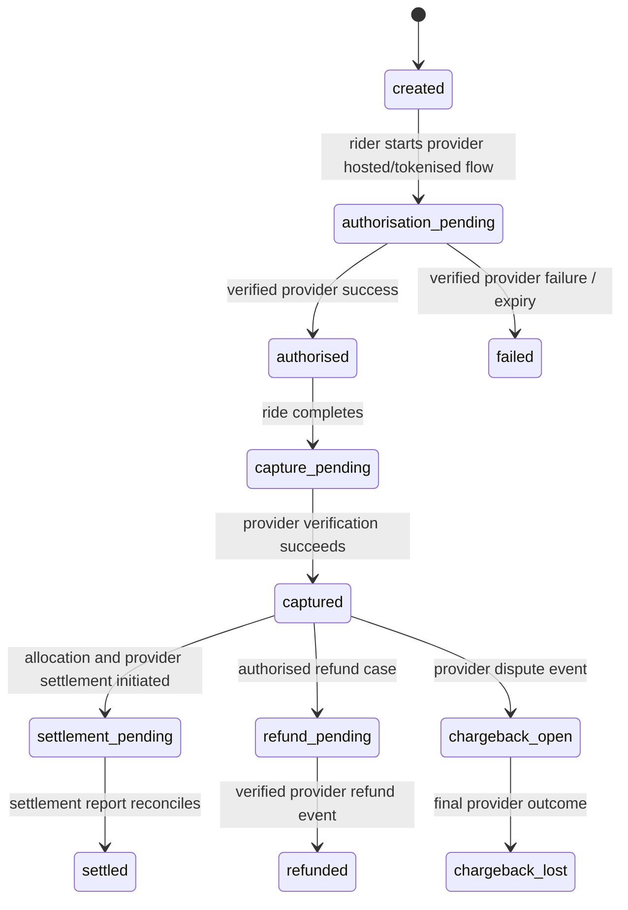
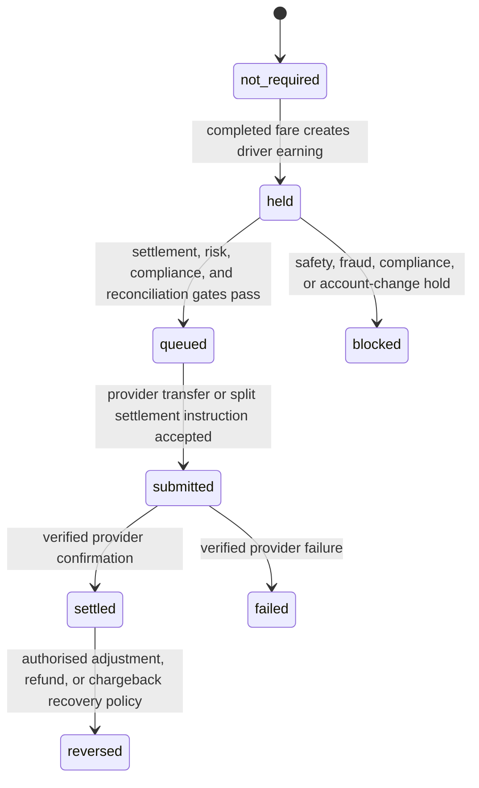

# Lagos Ride-Hailing Beta: Payment Gateway, Split Settlement, and Driver Payout Architecture

**Scope:** Card/bank-transfer collection and automated driver-earnings settlement for an invitation-only Lagos beta. The design uses a selected **CBN-licensed provider or bank** for collection, subaccount/recipient onboarding, settlement, and transfers. DeliveryPlatform maintains an auditable internal ledger and reconciliation process but does not use an unlicensed stored-value wallet or treat Redis as a financial system of record.

> **Regulatory boundary:** The CBN is Nigeria’s payments-system regulator and publishes authorised provider categories and licensees.[1] The technical ability of a gateway to split a transaction does not itself decide the legal marketplace model, merchant-of-record treatment, custody, tax, insurance, or driver classification. Before launch, obtain written advice from Nigerian payments/tax counsel and confirmation from the selected licensed provider/bank for the exact rider-to-driver funds flow.

## 1. Recommended beta model

The beta should use **provider-managed merchant collection with dynamic split allocation or provider-managed recipient settlement**, subject to the selected provider’s contract and legal confirmation. The platform collects a single rider payment through a hosted/tokenized provider flow; after the ride completes, the platform submits a final, versioned allocation plan. The provider then allocates the amount to the platform’s merchant settlement account and the verified driver’s provider subaccount or recipient account.

This model is safer than building an internal wallet because it:

1. keeps card/bank payment credentials with the licensed provider;
2. allows the provider to perform its required merchant/subaccount/recipient onboarding;
3. prevents the application from treating driver balances as freely transferable customer funds;
4. lets the platform retain an immutable ledger that proves the fare, allocation, settlement, refund, and payout state; and
5. retains the ability to place a contractually and lawfully approved payout hold for disputes, safety review, chargebacks, or reconciliation exceptions.

Two provider capabilities are relevant. CBN publishes payment-service provider and switching/processing categories; selection must be made from the current authorised list, not from marketing claims.[1] Paystack’s documentation, for example, describes merchant-to-subaccount multi-split settlement, including dynamic splits, and includes the split allocation in a successful transaction webhook.[2] Treat this only as a technical pattern; choose a provider only after current authorisation, commercial, technical, tax, and contractual due diligence.

## 2. Non-negotiable funds-flow rules

| Rule | Implementation consequence |
|---|---|
| The mobile client never declares a payment successful. | Only a verified provider event plus server-to-server verification may move a payment to `captured` or `settled`. |
| A driver bank account is never trusted from a client form alone. | Driver payout recipient/subaccount is created through provider onboarding and verified state; changes require step-up authentication, risk delay, and audit. |
| The final fare is immutable. | The database stores fare-rule version, trip meter, allocation version, and calculation hash. Corrections use explicit adjustment/refund transactions. |
| Each payment/payout action is idempotent. | Generate provider references from immutable IDs; use unique constraints in `provider_payment`, `provider_webhook_event`, and `driver_payout_instruction`. |
| The provider handles money movement; PostgreSQL handles accounting evidence. | Do not attempt to create a generic in-app wallet balance for riders/drivers. Ledger balances are audit/reconciliation projections, not a transferrable wallet API. |
| Payout is not equivalent to trip completion. | `completed` can precede `payout_eligible`; release occurs only after payment/settlement, risk/safety, dispute, and reconciliation gates pass. |
| Refunds and chargebacks are first-class events. | Never mutate the original fare. Post balanced reversing/adjustment entries, update provider events, and apply approved driver liability/hold policy. |

## 3. Provider abstraction

The application has a provider-neutral `PaymentRail` interface. Only a production adapter has access to provider credentials, through the Kubernetes external-secret boundary. Sandbox keys, test card data, transfer secrets, bank details, and callback payloads are never committed to Git or logged.

```text
interface PaymentRail {
  createCustomer(input: CustomerInput): ProviderCustomer
  createRecipient(input: DriverRecipientInput): ProviderRecipient
  initialiseCollection(input: CollectionRequest): CollectionIntent
  verifyCollection(providerReference: string): VerifiedCollection
  createSplitPlan(input: SplitPlanRequest): ProviderSplitPlan
  submitTransfer(input: DriverTransferRequest): ProviderTransfer
  verifyTransfer(providerTransferReference: string): VerifiedTransfer
  requestRefund(input: RefundRequest): ProviderRefund
  listSettlements(window: SettlementWindow): ProviderSettlement[]
}
```

The adapter must expose a **capability record** at configuration time, for example: `supports_card_preauthorisation`, `supports_dynamic_splits`, `supports_subaccounts`, `supports_recipient_transfers`, `supports_partial_refunds`, `supports_transfer_webhooks`, `supports_settlement_reports`, and `supports_NGN`. The beta activation check rejects a configuration whose required capabilities are missing.

## 4. Payment and payout state machines

### 4.1 Rider collection



### 4.2 Driver earnings and payout



The system must not make driver payout state contingent on an app notification. It changes only in the provider webhook worker after signature validation and provider-side transaction verification.

## 5. Fare allocation version

A fare is allocated from a versioned policy stored at completion. Amounts are stored in kobo (`BIGINT`) to avoid floating-point money errors.

```json
{
  "allocation_policy_version": "lag-beta-v1",
  "currency": "NGN",
  "gross_fare_kobo": 120000,
  "components": {
    "base_fare_kobo": 15000,
    "distance_kobo": 50000,
    "time_kobo": 30000,
    "demand_kobo": 10000,
    "toll_reimbursable_kobo": 5000,
    "tip_kobo": 10000
  },
  "allocation": {
    "driver_earnings_kobo": 80000,
    "platform_commission_kobo": 23000,
    "tax_and_statutory_kobo": 7000,
    "provider_fee_bearer": "platform"
  },
  "sum_check_kobo": 120000
}
```

`driver_earnings_kobo + platform_commission_kobo + tax_and_statutory_kobo` must equal `gross_fare_kobo` before provider fees. Provider processing fees are not silently subtracted from driver earnings unless the driver agreement, rider disclosure, provider split configuration, and finance policy expressly permit it. The application records the fee bearer and provider fee separately.

## 6. Concrete flow: ride completion to settlement

```mermaid
sequenceDiagram
  participant Ride as Ride Orchestrator
  participant Fare as Fare/Metering
  participant PG as PostgreSQL Ledger
  participant Rail as CBN-licensed Provider
  participant Webhook as Webhook Worker
  participant Driver as Driver App

  Ride->>Fare: Finalise meter and fare-rule version
  Fare->>PG: Store final fare and allocation policy
  Ride->>PG: Create payment/capture intent + payout instruction HELD
  PG-->>Ride: Committed transaction + outbox event
  Ride->>Rail: Capture/charge with immutable provider reference and split plan
  Rail-->>Webhook: Signed payment/settlement event
  Webhook->>PG: Store raw event, signature result, event id (idempotent)
  Webhook->>Rail: Server-to-server verify reference/status
  Rail-->>Webhook: Verified collection/split result
  Webhook->>PG: Post balanced ledger, mark payment captured/settled
  Webhook->>PG: Evaluate payout gate; queue or hold payout
  Webhook->>Rail: Submit recipient transfer if not provider-direct split
  Rail-->>Webhook: Signed transfer success/failure event
  Webhook->>PG: Verify and mark payout settled/failed
  PG-->>Driver: Outbox notification only after durable state commit
```

### Step 1 — Quote and payment readiness

The rider accepts a short-lived quote. If the provider and legal model support authorisation, create a provider authorisation intent before match confirmation. Otherwise use a verified payment-method eligibility check and charge after trip completion. The beta’s legal/commercial contract determines whether a pre-authorisation is permitted; the application must feature-flag the behavior rather than hard-code a gateway-specific assumption.

`provider_reference = "ride:<trip_uuid>:collection:<revision>"` is generated once. Retrying the same request uses the same reference and database idempotency key. A new revision is allowed only after an explicit cancellation/expiry state and is linked to the prior attempt.

### Step 2 — Final fare and allocation

At `completed_pending_payment`, the Fare/Metering service creates exactly one immutable `final_fare` record. The system validates:

* `final_amount >= 0`;
* fare components sum exactly to the total;
* allocation components sum exactly to the gross fare;
* applicable driver/vehicle/zone/policy versions are retained;
* the selected driver still has a valid verified payout recipient; and
* the payment is not already captured or refunded.

The system then writes `mobility.provider_payment` in `capture_pending`, `mobility.driver_payout_instruction` in `held`, an internal ledger transaction, and an outbox event in one PostgreSQL transaction.

### Step 3 — Capture and allocation

The provider adapter submits the immutable collection reference and either:

1. a provider **dynamic split/subaccount plan** where the provider’s settlement model supports it; or
2. a merchant collection followed by a **provider recipient transfer** after the beta’s approved hold/reconciliation gate.

For provider-managed split, store the provider split code/reference and returned allocation in `provider_payment`; do not infer allocations from the client or from current configuration. For a delayed recipient transfer, the driver’s earning remains a liability in the internal ledger until the provider confirms transfer settlement.

### Step 4 — Webhook and verify

The webhook ingress accepts raw bytes, extracts the provider event identity, validates the signature **before deserialising business data**, stores a deduplicated envelope, returns success only after durable enqueue, and processes asynchronously. For Paystack, official documentation specifies HMAC-SHA512 in `x-paystack-signature`; it also documents optional IP allowlisting.[3] Signature validation is required; IP restrictions are defense in depth, not a substitute.

The worker then calls the provider verification API using the immutable provider reference. It never promotes a payment/payout based solely on an inbound webhook. It locks the associated `provider_payment` or `driver_payout_instruction`, applies the state transition only if legal from the current state, posts idempotent ledger entries, and emits a notification outbox event.

### Step 5 — Payout release

The `driver_payout_instruction` begins in `held`. A policy job may set it to `queued` only if all gates pass:

```text
payment captured or verified provider split allocation
AND settlement/reconciliation state meets approved policy
AND driver profile, vehicle and insurance remain eligible
AND recipient account has not changed within the risk-hold period
AND no open safety, fraud, chargeback, refund, or compliance hold applies
AND daily reconciliation has no blocking variance for this transaction
AND beta payout-calendar / cash-flow policy is satisfied
```

The approved payout hold period must be set by legal/finance/risk owners and disclosed in the driver agreement; it must not be selected casually by engineering. A background worker submits `provider_transfer_reference = "ride:<trip_uuid>:driver:<driver_id>:payout:1"`. A unique constraint prevents duplicate transfers.

## 7. Internal double-entry accounting examples

The `mobility.ledger_*` tables in the companion DDL store immutable accounting evidence. The following is a logical mapping. Exact account names and tax handling need finance/tax approval.

### Successful collection, before provider payout

For a ₦1,200 gross fare (120,000 kobo), with 80,000 kobo driver earnings, 23,000 kobo platform commission, and 17,000 kobo tax/statutory amount:

| Debit account | Credit account | Amount (kobo) | Meaning |
|---|---|---:|---|
| `asset:provider_collection_clearing` | `liability:driver_earnings_payable:<driver>` | 80,000 | Provider has collected funds; driver amount is due but not yet settled. |
| `asset:provider_collection_clearing` | `revenue:ride_platform_commission` | 23,000 | Platform commission recognised under approved revenue policy. |
| `asset:provider_collection_clearing` | `liability:tax_and_statutory_payable` | 17,000 | Tax/levy obligation separated from platform revenue. |

The real ledger implementation posts this as a single balanced transaction with multiple debit/credit rows, not three unrelated mutations.

### Provider processing fee

If the provider deducts 2,000 kobo and the platform bears it:

| Debit account | Credit account | Amount (kobo) |
|---|---|---:|
| `expense:payment_processing_fee` | `asset:provider_collection_clearing` | 2,000 |

### Driver payout settlement

When a provider recipient transfer settles:

| Debit account | Credit account | Amount (kobo) |
|---|---|---:|
| `liability:driver_earnings_payable:<driver>` | `asset:provider_collection_clearing` or `asset:provider_payout_clearing` | 80,000 |

For provider-direct subaccount settlement, use a dedicated `provider_driver_split_clearing` account. Reconcile it to the provider’s split allocation/settlement report before closing the transaction. A provider webhook can signal allocation; the daily settlement file/report remains the reconciliation source.

### Refund, cancellation, or chargeback

Refund and chargeback workflows create a new, linked ledger transaction. They never edit the original capture. The driver impact must follow a written driver agreement and risk policy. The default beta-safe action is to block the outstanding payout before settlement; recovering an already-paid driver amount requires approved policy, fair notice, and legal review.

## 8. Recipient/subaccount onboarding

Each driver must complete provider/bank recipient onboarding before becoming payout-eligible. The platform stores only the provider recipient/subaccount reference and safe display metadata; encrypted bank-account details remain with the provider or a restricted vault only if legally necessary.

| Step | Required control |
|---|---|
| Create recipient/subaccount | Server-side only; driver identity/compliance state verified first. |
| Verify recipient | Use provider/bank verification and record outcome/reference; no manual “verified” toggle. |
| Change account | Step-up authentication, device/risk review, cooling-off hold, audit event, and driver notice. |
| Suspend recipient | Automatic when driver/compliance/safety state becomes ineligible; do not delete historic provider reference. |
| Reconcile account | Compare provider recipient status to `driver_profile.payout_state` daily; any mismatch blocks new payouts. |

## 9. Webhook ingress and reconciliation controls

| Control | Required behavior |
|---|---|
| Signature | Validate provider-specific signature over raw request body before business processing. |
| Origin | Allowlist documented provider origins where stable; do not rely on IP alone. |
| Idempotency | Unique `(provider, provider_event_id)` and `(provider, payload_sha512)` database constraints. |
| Verification | Call provider’s retrieve/verify endpoint before final state transition. |
| Ordering | Process a state machine; ignore or flag backwards/out-of-order events rather than overwrite state. |
| Raw evidence | Store encrypted/redacted payload with access control and retention schedule; never log PAN/card data or secrets. |
| Retry | Exponential retry with dead-letter record, alerting, and manual replay; provider events must be safely replayable. |
| Daily reconciliation | Match internal payments, provider transaction report, split/settlement report, transfers, refunds, chargebacks, and bank/cash-clearing statement. Zero unresolved variance is required before beta expansion. |
| Payout cut-off | Payout worker stops on provider status degradation, reconciliation failure, secret rotation failure, or safety/compliance hold. |

## 10. Provider selection and launch checklist

Before selecting a provider, obtain a signed due-diligence decision against these criteria.

| Criterion | Required evidence |
|---|---|
| Authorisation | Provider/bank appears in the relevant current CBN category or is otherwise confirmed authorised for the contracted service. [1] |
| Commercial/legal model | Written provider and counsel confirmation of merchant-of-record, split/recipient flow, settlement timing, refunds, chargebacks, holds, driver relationship, and tax implications. |
| Technical capability | NGN collection; required channels; tokenisation/hosted payment; webhook signatures; verification API; refunds; recipient/subaccount onboarding; transfers or split settlement; settlement reports; sandbox. |
| Security/privacy | PCI/credential handling is provider-owned; DPA; data locality/transfer assessment; incident notification; key rotation; webhook security; audit logs. |
| Operations | Support escalation, outage communications, settlement cut-off, reconciliation file/API, dispute timeline, and transaction/transfer limits. |
| Resilience | Multi-provider failover design for future scale; for beta, an explicit safe-degrade plan that blocks new matching/payment when the rail is unavailable. |

## 11. Beta acceptance tests

1. **Duplicate capture:** Submit the same ride completion/capture request 1,000 times; exactly one provider reference, one payment state transition, and one balanced ledger transaction result.
2. **Forged webhook:** Invalid signature cannot enqueue a financial event or mutate payment/payout state.
3. **Duplicate and reordered webhooks:** Replaying the same event and delivering settlement before capture never duplicates ledger postings or transfer instructions.
4. **Provider callback without verification:** A syntactically valid signed webhook whose provider verification status disagrees remains in review and blocks payout.
5. **Allocation integrity:** Every final fare passes `gross = driver + commission + tax/levy`; non-zero provider fees are separately accounted for and disclosed by approved policy.
6. **Payout hold:** An open safety/compliance/refund/chargeback case prevents transfer submission even after payment success.
7. **Recipient account takeover:** Payout account change triggers step-up and holding period; no same-session transfer can use the new recipient without approved verification.
8. **Refund:** Refund posts a balanced linked transaction, updates payment state, updates payout eligibility, and produces reconcilable provider evidence.
9. **Daily reconciliation:** Intentional mismatch in collection, split, transfer, or fee report creates an exception and halts the affected payout batch.
10. **Secret rotation:** Provider webhook and API secrets rotate through the approved external-secret path without logging, downtime, or acceptance of stale signatures beyond configured overlap.

## References

[1] [Central Bank of Nigeria: payment service providers](https://www.cbn.gov.ng/PaymentsSystem/PSPs.html) and [payments-system supervision](https://www.cbn.gov.ng/PaymentsSystem/)  
[2] [Paystack: multi-split payments](https://paystack.com/docs/payments/multi-split-payments/)  
[3] [Paystack: webhook validation](https://paystack.com/docs/payments/webhooks/)  
[4] [Lagos Beta Payment Integration Research Notes](lagos_beta_payment_integration_research_notes_20260903.md)  
[5] [Geospatial matching and Nigeria private-beta specification](geospatial_matching_and_nigeria_private_beta_spec_20260903.md)
