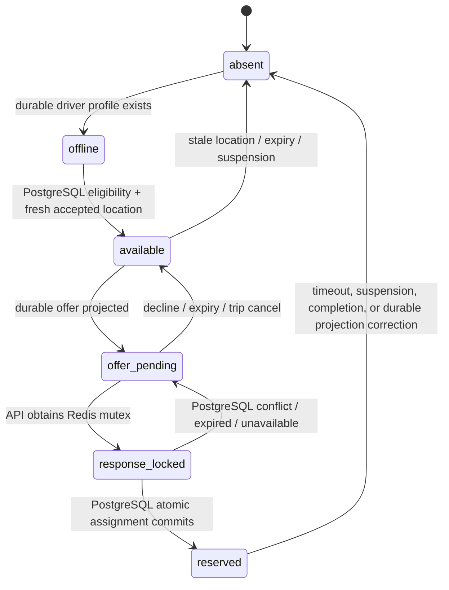

# Redis State Machine for Real-Time Passenger–Driver Matching

**Role:** Redis is a low-latency, rebuildable projection for geospatial search, liveness, offer notification, and short response locks. PostgreSQL/PostGIS remains the sole authority for driver eligibility, trip state, driver assignment, fare, payment, payout, and audit history.

> A successful Redis operation is never proof that a passenger trip is assigned. The authoritative `mobility.accept_driver_offer(...)` PostgreSQL transaction must commit before the Ride API returns an assignment to a rider or driver.

## 1. Consistency model

The system is **PostgreSQL-authoritative with at-least-once projection to Redis**. Every durable state transition writes an `mobility.outbox_event` in the same PostgreSQL transaction. A projection worker publishes that event to Redis. Redis consumers may observe a delayed or missing projection; they must recover through a durable read and projection replay.

| Operation | Write order | Authoritative result |
|---|---|---|
| Driver becomes available | PostgreSQL `driver_presence` update and outbox commit; then Redis projection. | PostgreSQL presence/version. |
| Location update | PostgreSQL append-only sample and presence version commit; then Redis GEO/HASH upsert. | PostgreSQL latest accepted sample. |
| Offer creation | PostgreSQL offer rows and match-attempt commit; then Redis offer cache/notification. | PostgreSQL pending offer row and expiry. |
| Driver accepts offer | Redis response mutex only; then PostgreSQL `accept_driver_offer` transaction; then Redis projection. | PostgreSQL assignment guard + trip event. |
| Driver suspension or document expiry | PostgreSQL eligibility/presence change and outbox commit; then Redis removal. | PostgreSQL eligibility and presence. |

A projection worker must be idempotent. Each event carries an aggregate ID, aggregate version, and unique outbox ID. The Redis hash stores `pg_version`; a projection event only applies if its version is strictly newer than the cached value.

## 2. Keyspace and TTL policy

All keys use hash tags so each driver’s related keys can be atomically processed in Redis Cluster.

| Key pattern | Redis type | Primary fields/value | TTL | Writer |
|---|---|---|---|---|
| `rh:driver:{<id>}:presence` | Hash | `pg_version`, `state`, `zone_id`, `lat`, `lng`, `location_valid_until_ms`, `integrity_score`, `vehicle_id`. | Location freshness + 30 s grace. | Presence projection worker. |
| `rh:zone:{<zone>}:available` | GEO/ZSET | member: driver ID; longitude/latitude. | Members removed explicitly; periodic reaper. | Presence projection worker. |
| `rh:driver:{<id>}:offer` | Hash | `offer_id`, `trip_id`, `expires_at_ms`, `pg_version`, `state`. | Offer expiry + 30 s. | Offer projection worker. |
| `rh:trip:{<trip>}:offer_ids` | Set | active offer UUIDs. | Match attempt max lifetime + 5 min. | Offer projection worker. |
| `rh:driver:{<id>}:response_lock` | String | random request token. | 5 s. | Ride API during driver response. |
| `rh:driver:{<id>}:assignment_hint` | String | trip UUID and PostgreSQL assignment version. | Reservation lease / refreshed by outbox. | Assignment projection worker. |
| `rh:dispatch:outbox:cursor` | String | last durable outbox ID seen. | No expiry. | Projection worker. |
| `rh:dispatch:metrics` | Stream or counters | non-sensitive operational telemetry. | Per observability retention. | Workers. |

**Forbidden Redis data:** full rider name, telephone, email, payment tokens, PIN, raw compliance documents, background-screen results, exact safety-case content, unencrypted bank-account data, or any value the data-retention policy classifies as restricted.

## 3. State transitions



Redis does not model `on_trip` independently. Once PostgreSQL commits a reservation, the presence projection removes the driver from every available-zone GEO set and writes only a short `assignment_hint`; all detailed trip status comes from the Ride API backed by PostgreSQL.

## 4. Projection event contracts

Every outbox message is versioned and contains no more data than Redis needs.

```json
{
  "event_id": "2d15a135-bf28-4dab-b80f-f9cc7d4ef30a",
  "event_type": "mobility.driver_presence.updated",
  "occurred_at": "2026-09-03T18:00:00Z",
  "driver_user_id": 412,
  "pg_version": 41,
  "state": "available",
  "zone_id": "0d070f45-568a-488c-bfbd-93d78d98f3d7",
  "lat": 6.5244,
  "lng": 3.3792,
  "location_valid_until_ms": 1788458430000,
  "integrity_score": 96,
  "vehicle_id": "2b7497a2-d0b5-4fa6-ac43-8c66c8386764"
}
```

The projector validates event schema, checks that it is newer than the cached `pg_version`, updates the driver hash, and adds/removes the GEO member based on `state='available'` and freshness. It writes the outbox completion only after Redis returns success. Re-delivery is safe.

## 5. Lua functions

### 5.1 Presence projection apply

The worker invokes the following function only after the corresponding PostgreSQL transaction commits. `KEYS[1]` is the driver presence hash; `KEYS[2]` is the zone GEO set. The caller must pass the driver ID as `ARGV[1]`.

```lua
-- rh_apply_presence_v1.lua
-- KEYS[1] = rh:driver:{id}:presence
-- KEYS[2] = rh:zone:{zone}:available
-- ARGV[1]  = driver id
-- ARGV[2]  = incoming pg_version
-- ARGV[3]  = state
-- ARGV[4]  = zone_id
-- ARGV[5]  = latitude
-- ARGV[6]  = longitude
-- ARGV[7]  = location_valid_until_ms
-- ARGV[8]  = integrity_score
-- ARGV[9]  = vehicle_id or empty
-- ARGV[10] = ttl_seconds

local current = tonumber(redis.call('HGET', KEYS[1], 'pg_version') or '-1')
local incoming = tonumber(ARGV[2])
if incoming <= current then
  return {0, 'stale_projection'}
end

local state = ARGV[3]
if state == 'available' then
  redis.call('HSET', KEYS[1],
    'pg_version', ARGV[2], 'state', state, 'zone_id', ARGV[4],
    'lat', ARGV[5], 'lng', ARGV[6],
    'location_valid_until_ms', ARGV[7],
    'integrity_score', ARGV[8], 'vehicle_id', ARGV[9])
  redis.call('EXPIRE', KEYS[1], tonumber(ARGV[10]))
  redis.call('GEOADD', KEYS[2], ARGV[6], ARGV[5], ARGV[1])
  return {1, 'available'}
end

-- Safety first: remove availability before caching any nonavailable state.
redis.call('ZREM', KEYS[2], ARGV[1])
redis.call('HSET', KEYS[1],
  'pg_version', ARGV[2], 'state', state, 'zone_id', ARGV[4],
  'location_valid_until_ms', ARGV[7], 'integrity_score', ARGV[8])
redis.call('EXPIRE', KEYS[1], tonumber(ARGV[10]))
return {1, 'not_available'}
```

If a driver changes zones, the worker first removes the driver from the prior zone GEO set, then calls this script for the new zone. The old-zone cleanup is idempotent. A periodic reaper scans only known zone sets and removes members whose presence hash is absent, non-available, or past `location_valid_until_ms`.

### 5.2 Driver response mutex

This mutex does not grant a ride. It limits duplicate client taps and competing app sessions while the API calls PostgreSQL.

```lua
-- rh_acquire_response_lock_v1.lua
-- KEYS[1] = rh:driver:{id}:response_lock
-- ARGV[1] = cryptographically random request token
-- ARGV[2] = ttl milliseconds (5000)

if redis.call('SET', KEYS[1], ARGV[1], 'NX', 'PX', ARGV[2]) then
  return 1
end
return 0
```

The Ride API flow is:

1. Authenticate the driver and validate the request/offer UUID.
2. Acquire `response_lock`; return a retriable `409 response_in_progress` if held.
3. Execute `SELECT * FROM mobility.accept_driver_offer(...)` using the API idempotency key.
4. If PostgreSQL commits, return the committed assignment projection. Do not wait for Redis.
5. Delete the mutex only if token equality matches; otherwise allow the short TTL to expire.
6. On SQL conflict/expiry, return the deterministic result and let the durable outbox update Redis.

### 5.3 Safe mutex release

```lua
-- rh_release_response_lock_v1.lua
-- KEYS[1] = rh:driver:{id}:response_lock
-- ARGV[1] = request token
if redis.call('GET', KEYS[1]) == ARGV[1] then
  return redis.call('DEL', KEYS[1])
end
return 0
```

### 5.4 Offer projection

```lua
-- rh_apply_offer_v1.lua
-- KEYS[1] = rh:driver:{id}:offer
-- KEYS[2] = rh:trip:{trip}:offer_ids
-- ARGV[1] = offer id
-- ARGV[2] = trip id
-- ARGV[3] = pg_version
-- ARGV[4] = expires_at_ms
-- ARGV[5] = ttl_seconds

local current = tonumber(redis.call('HGET', KEYS[1], 'pg_version') or '-1')
if tonumber(ARGV[3]) <= current then return {0, 'stale_projection'} end
redis.call('HSET', KEYS[1],
  'offer_id', ARGV[1], 'trip_id', ARGV[2],
  'pg_version', ARGV[3], 'expires_at_ms', ARGV[4], 'state', 'pending')
redis.call('EXPIRE', KEYS[1], tonumber(ARGV[5]))
redis.call('SADD', KEYS[2], ARGV[1])
redis.call('EXPIRE', KEYS[2], tonumber(ARGV[5]) + 300)
return {1, 'offer_projected'}
```

## 6. Read path for candidate discovery

The matching service uses Redis only to obtain a short candidate shortlist:

1. Query `GEOSEARCH rh:zone:{zone}:available FROMLONLAT <lng> <lat> BYRADIUS <radius> m ASC COUNT <candidate_limit>`.
2. Pipeline `HMGET` of `presence` hash for the returned drivers; discard absent hashes, non-available state, stale `location_valid_until_ms`, low integrity, or wrong zone.
3. Submit only the shortlisted driver IDs and trip feature vector to the Rust dispatch scorer/routing adapter.
4. Before generating offers, run the PostgreSQL eligibility/presence query under the matching transaction. Redis candidates are hints; PostgreSQL confirms all eligibility.
5. Insert `match_attempt` and `driver_offer` rows in PostgreSQL; commit; emit outbox events; then send offer notifications.

If Redis is unavailable, use a bounded PostGIS candidate query against `mobility.driver_presence` and mark matching latency/degradation. If PostgreSQL is unavailable, do not offer, reserve, start, complete, charge, or settle any trip.

## 7. Cache rebuild and disaster recovery

On Redis loss or cluster replacement:

1. Pause new offer notifications but keep existing PostgreSQL trip states authoritative.
2. Rebuild only eligible fresh driver presence from `mobility.driver_presence` joined to `mobility.driver_eligibility`; never reconstruct from stale raw location history alone.
3. Reproject non-expired pending offers from `mobility.driver_offer`.
4. Reproject active assignment hints from `mobility.driver_assignment_guard`.
5. Replay unpublished and recently published outbox events with version checks.
6. Re-enable matching only after projection lag and key counts meet thresholds.

Redis persistence may improve recovery time but must not be treated as an audit or financial data store. Use TLS, ACLs, separate application users, no public endpoint, encrypted backups where enabled, and monitoring for eviction, replication lag, memory pressure, expired-key rate, and projection backlog.

## 8. Required tests

| Test | Expected assertion |
|---|---|
| Projection replay | Replaying every outbox event in random duplicate order yields the same Redis state as one ordered replay. |
| Redis partition | Matching falls back to bounded PostGIS; no duplicate PostgreSQL assignment is possible. |
| Redis flush | Rebuild restores only drivers with eligible, fresh, durable presence. |
| Concurrent acceptance | 1,000 concurrent app requests produce one PostgreSQL guard row and exactly one accepted offer. |
| Stale projection | A lower `pg_version` cannot move a reserved/suspended driver back to `available`. |
| Document expiry | Durable eligibility false event removes a driver from GEO results before the next offer wave. |
| Location expiry | Reaper excludes stale driver even if a GEO member was not explicitly removed. |
| Privacy | Redis key scan contains no rider names, raw address, phone, PIN, payment token, document, or safety evidence. |
